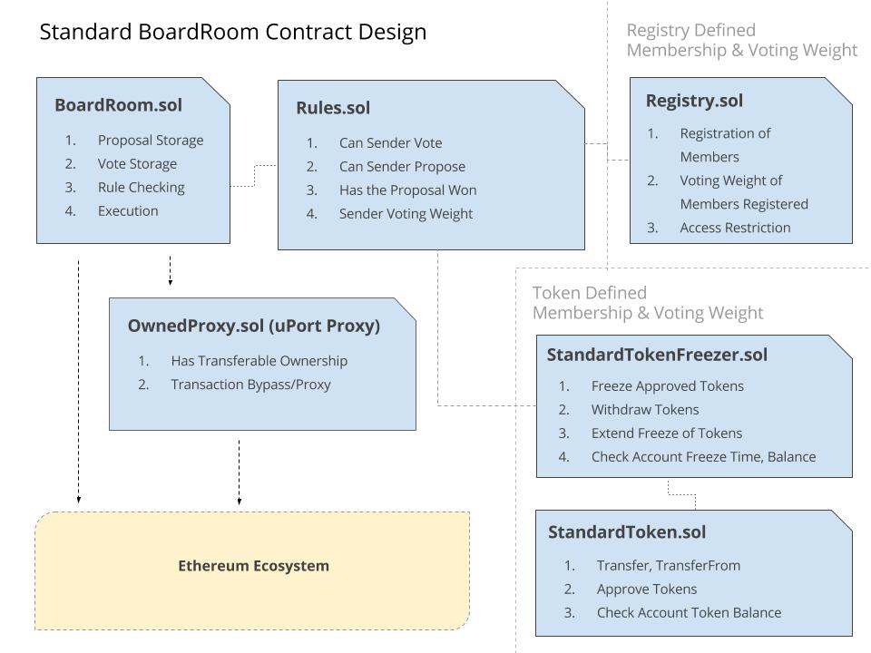

# boardroom-contracts
All BoardRoom contracts.



## Install
```
git clone https://github.com/boardroom-project/boardroom-contracts.git
npm install
```

## Example Rules Contract

Here anyone can vote and table proposals. The voting weight is hard coded at 1. Anyone can vote multiple times, and a proposal has won only when people who voted yea is greater than nay.

```
import "Rules.sol";
import "BoardRoom.sol";

contract OpenRules is Rules {
  function hasWon(uint _proposalID) constant returns (bool) {
    BoardRoom board = BoardRoom(msg.sender);
    uint nay = board.positionWeightOf(_proposalID, 0);
    uint yea = board.positionWeightOf(_proposalID, 1);

    if(yea > nay) {
      return true;
    }
  }

  function canVote(address _sender, uint _proposalID) constant returns (bool) {
    return true;
  }

  function canPropose(address _sender) constant returns (bool) {
    return true;
  }

  function votingWeightOf(address _sender, uint _proposalID) constant returns (uint) {
    return 1;
  }
}
```

## Examples

Here are some other Rules contract examples, found in `contracts/examples`, please refer to the unit tests for deployment and setup information regarding these rule sets.

 1. [TorontoRules](https://github.com/boardroom-project/boardroom-contracts/blob/master/contracts/examples/TorontoRules.sol) - Curators, 60% Majority, 50% Minimum Voters
 2. [CuratorRules](https://github.com/boardroom-project/boardroom-contracts/blob/master/contracts/examples/CuratorRules.sol) - Curators, Yay > Nay
 3. [TokenFreezerRules](https://github.com/boardroom-project/boardroom-contracts/blob/master/contracts/examples/TokenFreezerRules.sol) - StandardToken Voting, Freeze Period > Debate Period
 4. [SixtyPercentRules](https://github.com/boardroom-project/boardroom-contracts/blob/master/contracts/examples/SixtyPercentRules.sol) - 60% Majority, 50% Minimum Voters
 5. [OpenRegistryRules](https://github.com/boardroom-project/boardroom-contracts/blob/master/contracts/examples/OpenRegistryRules.sol) - Anyone Can Register as Member, Voting Weight 1
 6. [CampaignRules](https://github.com/boardroom-project/boardroom-contracts/blob/master/contracts/examples/CampaignRules.sol) - WeiFund StandardCampaign Contribution Amount = Voting Weight/Membership
 7. [MetaRules](https://github.com/boardroom-project/boardroom-contracts/blob/master/contracts/examples/MetaRules.sol) - Typed Proposals, Rules Contract per Proposal Type (good for multi-class share voting)
 8. [OpenRules](https://github.com/boardroom-project/boardroom-contracts/blob/master/contracts/examples/OpenRules.sol) - Any account can vote, propose, voting weight = 1, yay > nay to win
 9. [SingleAccountRules](https://github.com/boardroom-project/boardroom-contracts/blob/master/contracts/examples/SingleAccountRules.sol) - A single account can vote, propose, anything proposed wins
 10. [MultiSigRules](https://github.com/boardroom-project/boardroom-contracts/blob/master/contracts/examples/MultiSigRules.sol) - 100% consensus required to win, signatories can propose, yay vote is signoff
 11. [DecayingQuorumRules](https://github.com/boardroom-project/boardroom-contracts/blob/master/contracts/examples/DecayingQuorumRules.sol) - Min quorum to win decays over block time
 12. [BondRules](https://github.com/boardroom-project/boardroom-contracts/blob/master/contracts/examples/BondRules.sol) - A bond is required for voting, and a proposal to pass

## Contract Interfaces

BoardRoom has two prominent contractal interfaces. The `BoardRoom` contract interface, and the `Rules` interface. The Rules interface is mainly used by the core BoardRoom contract, while the UI should primarily interact with the BoardRoom interface and contract.

### BoardRoom

The BoardRoom contract is an interface for contractual governance on Ethereum. A proposal is made, voted on, and executed. The abstract input is transaciton information, the output is a single transaction. It handles proposal creation, storage, voting, rule checking and execution. Having essential proposal data closer to the execution environment is both gas efficient and allows for the minimum amount of storage calls per execution.

```
contract BoardRoom {
  function newProposal(string _name, address _proxy, uint _debatePeriod, address _destination, uint _value, bytes _calldata) returns (uint proposalID) {}
  function vote(uint _proposalID, uint _position) returns (uint voteWeight) {}
  function execute(uint _proposalID, bytes _calldata) {}
  function changeRules(address _rules) {}

  function voterAddressOf(uint _proposalID, uint _voteID) constant returns (address) {}
  function numVoters(uint _proposalID) constant returns (uint) {}
  function positionWeightOf(uint _proposalID, uint _position) constant returns (uint) {}
  function voteOf(uint _proposalID, address _voter) constant returns (uint, uint, uint) {}
  function hasVoted(uint _proposalID, address _voter) constant returns (bool) {}

  function destinationOf(uint _proposalId) public constant returns (address) {}
  function proxyOf(uint _proposalId) public constant returns (address) {}
  function valueOf(uint _proposalId) public constant returns (uint) {}
  function hashOf(uint _proposalId) public constant returns (bytes32) {}
  function debatePeriodOf(uint _proposalId) public constant returns (uint) {}
  function createdOn(uint _proposalId) public constant returns (uint) {}
  function createdBy(uint _proposalId) public constant returns (address) {}

  event ProposalCreated(uint _proposalID, address _destination, uint _value);
  event VoteCounted(uint _proposalID, uint _position, address _voter);
  event ProposalExecuted(uint _proposalID, address _sender);
}
```

Note: other data getters are the public constant methods `proposals(num uint ID)` and `rules()`.

### Rules

The Rules contract is a simple interface to layout contractual governance rules on Ethereum. BoardRoom contracts are created with a single Rules contract specified in the constructor. The Rules contract specifies if a proposal is won, if a sender can vote on a specific proposal, if a sender can propose a proposal and the voting weight or a sender on a specific proposal. The Rules contract can remain simple and re-usable by multiple Boards, or specific to a single Board.

```
contract Rules {
  function hasWon(uint _proposalID) constant returns (bool);
  function canVote(address _sender, uint _proposalID) constant returns (bool);
  function canPropose(address _sender) constant returns (bool);
  function votingWeightOf(address _sender, uint _proposalID) constant returns (uint);
}
```

## Example Board
An example OpenRules BoardRoom is deployed here, this will allow you to load and interact with the BoardRoom contract on testnet without having to deploy your own.

```
TestNet:
  1. OpenRules.sol
  0x59dcac601282ae67042d97c543ff524ec8509911

  2. BoardRoom.sol
  0xd89b8a74c153f0626497bc4a531f702c6a4b285f
```

## Usage

```js
// require web3 and instantiate a web3 instance
const Web3 = require('web3');
const web3 = new Web3(new web3.providers.HttpProvider('https://morden.infura.io:8545'));

// Instantiate BoardRoom contracts
const boardroomContracts = require('boardroom-contracts');
const BoardRoom = web3.eth.contract(JSON.parse(boardroomContracts.contracts.BoardRoom.interface));

// Example Instance (live on morden testnet**)
const boardroomInstance = BoardRoom.at('0xd89b8a74c153f0626497bc4a531f702c6a4b285f');

// Helper Values
const unixDay = 24 * 60 * 60;
const emptyBytes = '';
const emptyWeb3Address = 0;


/*
// =======================
// CREATING A NEW PROPOSAL
// =======================

// Create a New Proposal
boardroomInstance.newProposal(
  "My New Dummy Proposal",
  emptyWeb3Address,
  30 * unixDay,
  '0x59dcac601282ae67042d97c543ff524ec8509911',
  5000,
  emptyBytes, function(newProposalError, newProposalTxHash){
  console.log('New Proposal:', newProposalError, newProposalTxHash);  
});

// Listen for New Proposals
boardroomInstance.ProposalCreated({}, function(proposalCreatedError, proposalCreatedResult){
  console.log('New Proposal Listener', proposalCreatedError, proposalCreatedResult);
});
*/


/*
// =======================
// VOTING ON A PROPOSAL
// =======================

// Vote on a Proposal (vote 1 "yes" on proposal ID 2)
boardroomInstance.vote(2, 1, function(voteError, voteTxHash){
  console.log('Vote Error', voteError, voteTxHash);
});

// Listen for New Vote
boardroomInstance.VoteCounted({_proposalID: 2}, function(voteCountedError, voteCountedResult){
  console.log('Vote Counted', voteCountedError, voteCountedResult);
});
*/


/*
// =======================
// EXECUTING A PROPOSAL
// =======================

// Execute a Proposal (with ID 2)
boardroomInstance.execute(2, emptyBytes, function(executeError, executeTxHash){
  console.log('Proposal Execute', executeError, executeTxHash);
});

// Listen for Executed Proposal
boardroomInstance.ProposalExecuted({_proposalID: 2}, function(proposalExecutedError, proposalExecutedResult){
  console.log('Proposal Executed', proposalExecutedError, proposalExecutedResult);
});
*/


// Get Proposal Data (from proposal ID 2)
boardroomInstance.proposals(2, function(proposalsError, proposalDataArray){
  if (!proposalsError) {
    const proposalData = {
      name: proposalDataArray[0],   // string
      destination: proposalDataArray[1],  //string
      proxy: proposalDataArray[2],  // string
      value: proposalDataArray[3], // BigNumber
      hash: proposalDataArray[4], // string
      executed: proposalDataArray[5], // bool
      debatePeriod: proposalDataArray[6], // BigNumber
      created: proposalDataArray[7], // BigNumber
    };

    console.log('Proposal ID #2', proposalData);
  }
});


// Get Total Number of Proposals
boardroomInstance.numProposals(function(numProposalsError, numProposals){
  console.log('Number of Proposals', numProposalsError, numProposals.toString(10));
});
```

## Deloyment Flow

The standard BoardRoom contract deployment flow is as follows:

[Rule Contract Requirement contracts] => Rules.sol => BoardRoom.sol [=> Proxy.sol contracts]

## Deploy Example OpenRules Board on Testnet
  1. First create a JSON just outside the `boardroom-contracts` directory called `account.json`
  2. In `account.json` put your account address and private key `{"address": "0x0..", "privateKey": "000..."}`
  3. Make sure the account used has a Testnet ether balance
  4. Run ethdpeloy: `npm run deploy:openboard`

## Test
```
npm test
```

## Build
```
npm run build
```
